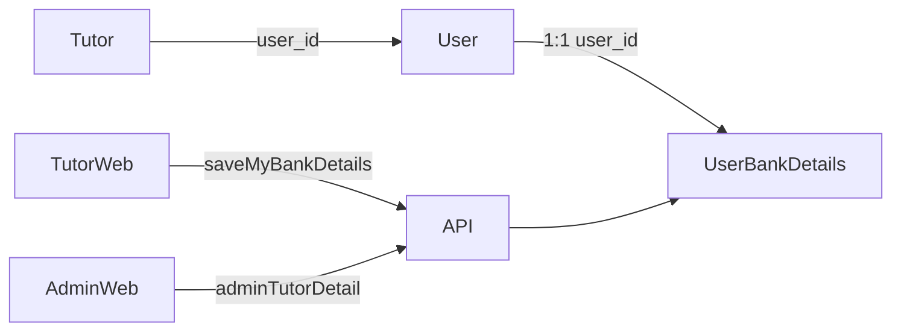

# User Bank Details for Tutor Payments

## Architecture

Store bank details on **User**, not Tutor, via a new 1:1 table so the same model works when student refund bank details are added later.



**New entity:** [`user_bank_details`](apps/api/src/app/modules/user-bank-details/entities/user-bank-details.entity.ts)

| Column | Type | Notes |
|--------|------|-------|
| `user_id` | FK, unique | 1:1 with `user` |
| `bank_name` | varchar | Final display name (from dropdown or manual entry) |
| `account_number` | varchar | Full number stored server-side |
| `ifsc_code` | varchar(11) | Uppercased on save |
| `gst_number` | varchar, nullable | `null` when not provided (treat as N/A) |

Plus standard `QBaseEntity` fields (`id`, `createdDate`, etc.).

**Migration:** [`apps/api/src/migrations/1775000000000-CreateUserBankDetails.ts`](apps/api/src/migrations/1775000000000-CreateUserBankDetails.ts) — register entity in [`database.config.ts`](apps/api/src/app/database/database.config.ts) and new [`UserBankDetailsModule`](apps/api/src/app/modules/user-bank-details/user-bank-details.module.ts) in [`app.module.ts`](apps/api/src/app/app.module.ts).

---

## Backend API

### New module: `user-bank-details`

Follow existing patterns from [`AddressModule`](apps/api/src/app/modules/address/address.module.ts) / [`address.resolver.ts`](apps/api/src/app/modules/address/resolvers/address.resolver.ts).

**Service** (`user-bank-details.service.ts`):
- `findByUserId(userId)` — load row or `null`
- `saveForUser(userId, input)` — upsert; validate IFSC/account/GST
- `mapToGraphql(details, viewerRole)` — build response DTO

**Validation** (class-validator on `SaveUserBankDetailsInput`):
- `bankName`: required, max 120 chars
- `accountNumber`: required, digits only, 9–18 chars
- `ifscCode`: required, `/^[A-Z]{4}0[A-Z0-9]{6}$/` (auto-uppercase)
- `gstNumber`: optional; if provided and not empty, validate GSTIN format; if empty/omitted, store `null`

**GraphQL type** `UserBankDetails`:
- `bankName`, `ifscCode`, `gstNumber` (nullable)
- `accountNumberMasked` — e.g. `xxxxxx1234` (last 4 digits visible)
- `accountNumber` — **full value only when viewer is ADMIN**; field resolver checks JWT role, returns `null` for non-admins even if queried
- `isComplete` — `true` when `bankName`, `accountNumber`, and `ifscCode` are present

**Mutation** `saveMyBankDetails(input)`:
- `@UseGuards(JwtAuthGuard)` + `@CurrentUser()`
- Upserts for authenticated user (role-agnostic API; tutor UI uses it now, students later)
- Returns masked view (no full account number)

**Read path:** Extend [`TutorDetailService.getTutorDetail`](apps/api/src/app/modules/tutor/services/tutor-detail.service.ts) to load bank details by `tutor.user.id` and attach to [`AdminTutorDetailUser`](apps/api/src/app/modules/admin/dto/admin-tutor-detail-user.dto.ts) as optional `bankDetails?: UserBankDetails`.

No new top-level query needed — bank details ride along with existing `myTutorDetail` and `adminTutorDetail`.

---

## Shared libraries

### Indian banks list

Add [`libs/shared-utils/src/indian-banks.ts`](libs/shared-utils/src/indian-banks.ts):
- Constant array of ~25 major Indian banks (SBI, HDFC, ICICI, Axis, Kotak, PNB, BOB, Canara, Union Bank, IDFC First, Yes Bank, etc.)
- Export sentinel `OTHER_BANK_OPTION = 'My bank is not in the list'`
- Export from [`libs/shared-utils/src/index.ts`](libs/shared-utils/src/index.ts)

### Formatters

Add [`libs/shared-utils/src/bank-details-formatters.ts`](libs/shared-utils/src/bank-details-formatters.ts):
- `maskAccountNumber(accountNumber)` → `xxxxxx1234`
- `isBankDetailsComplete(details)` → boolean
- `formatGstDisplay(gstNumber)` → value or omit when null/N/A

### GraphQL client

- New [`libs/shared-graphql/src/mutations/user-bank-details.mutations.ts`](libs/shared-graphql/src/mutations/user-bank-details.mutations.ts): `SAVE_MY_BANK_DETAILS`
- Extend `user { bankDetails { ... } }` in:
  - [`GET_MY_TUTOR_DETAIL`](libs/shared-graphql/src/queries/tutor.queries.ts) — request `accountNumberMasked`, not `accountNumber`
  - [`GET_ADMIN_TUTOR_DETAIL`](libs/shared-graphql/src/queries/admin.queries.ts) — request full `accountNumber`
- Export from [`mutations/index.ts`](libs/shared-graphql/src/mutations/index.ts)

### UI types

Extend [`libs/tutor-detail-ui/src/types.ts`](libs/tutor-detail-ui/src/types.ts) `TutorDetailRecord.user`:

```ts
bankDetails?: {
  bankName?: string | null;
  ifscCode?: string | null;
  accountNumberMasked?: string | null;
  accountNumber?: string | null; // admin only
  gstNumber?: string | null;
  isComplete?: boolean;
} | null;
```

---

## UI — shared `tutor-detail-ui`

### Placement

In [`TutorDetailView.tsx`](libs/tutor-detail-ui/src/TutorDetailView.tsx), insert **immediately below** the profile header card (after line ~484, before `OfferingsSection`) for **both** `mode="tutor"` and `mode="admin"`.

### New components

1. **`BankDetailsSection.tsx`** — compact card (reuse `SectionCard` styling; add new `bank` entry to `SECTION_STYLES`)

   **Tutor mode — empty:**
   - Text: `To be entered`
   - Button: `Enter bank details`

   **Tutor mode — filled:**
   - Bank name
   - IFSC code
   - Account no: `{accountNumberMasked}` (prefix label as specified)
   - GST line **only if** `gstNumber` is set
   - Button: `Edit bank details`

   **Admin mode — empty:**
   - `Not entered` (read-only, no edit button)

   **Admin mode — filled:**
   - Same fields; show **full** `accountNumber` instead of masked

2. **`BankDetailsModal.tsx`** — tutor-only modal (pattern from [`PasswordModal.tsx`](apps/web/src/app/components/sign-up/PasswordModal.tsx)):
   - Bank `<select>` populated from `INDIAN_BANKS` + “My bank is not in the list”
   - Conditional text input when “other” selected
   - Account number, IFSC, GST (optional; helper text “Leave blank if not applicable”)
   - Save / Cancel; inline validation errors
   - On edit: account number field empty with placeholder “Re-enter to update” (require re-entry on save to change account number, or always send full value from form — simpler to always require full account number in form)

### Wiring

[`TutorProfilePage.tsx`](apps/web/src/app/components/tutor-profile/TutorProfilePage.tsx):
- Pass `onSaveBankDetails` + `savingBankDetails` props into `TutorDetailView`
- `useMutation(SAVE_MY_BANK_DETAILS)` + `refetch()` on success

[`TutorDetailPage.tsx`](apps/web-admin/src/app/pages/TutorDetailPage.tsx): no mutation wiring — read-only admin display only.

Export new components from [`libs/tutor-detail-ui/src/index.ts`](libs/tutor-detail-ui/src/index.ts).

**Out of scope:** Mobile [`TutorDetailScreen.tsx`](apps/mobile/src/app/components/tutor-profile/TutorDetailScreen.tsx) — API will be ready; mobile UI can follow later.

---

## Security notes

- Full account number never returned to tutor clients (field resolver + query field selection).
- Admin full number only via `adminTutorDetail` (already `@Roles(ADMIN)`).
- Consider encryption-at-rest as a follow-up; not blocking for v1 but worth a TODO in service layer.

---

## Test plan

**Backend**
- Unit tests for `UserBankDetailsService`: validation, upsert, masking, admin vs tutor field mapping
- Extend [`tutor-detail.service.spec.ts`](apps/api/src/app/modules/tutor/services/tutor-detail.service.spec.ts) to assert `bankDetails` included when present

**Manual**
- Tutor web: empty state → enter details → masked display → edit updates
- Admin web: same tutor shows full account number; GST hidden when not provided
- Verify non-admin GraphQL cannot retrieve `accountNumber` even if requested
