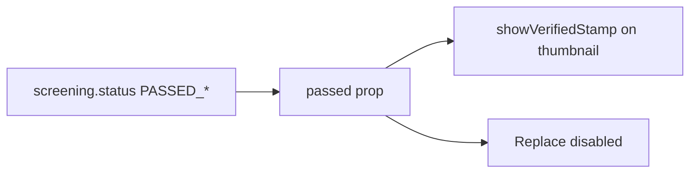

# Verified Stamp on Document Thumbnail

## Scope

Web-only UI enhancement in the tutor docs upload step. Show the provided green **VERIFIED** stamp on the thumbnail when `passed === true` (`PASSED_AUTOMATED` or `APPROVED_HUMAN`) — same gate already used to disable **Replace file**.

No API or GraphQL changes.

## Current hook point

[`DocumentUploadCard.tsx`](apps/web/src/app/components/tutor-onboarding/tutor-docs-upload/DocumentUploadCard.tsx) already receives `passed` from [`TutorDocsUpload.tsx`](apps/web/src/app/components/tutor-onboarding/tutor-docs-upload/TutorDocsUpload.tsx) via `screeningPassed()`. Thumbnail rendering lives in the local `DocumentThumbnail` subcomponent (lines 35–81).

## Implementation

### 1. Add stamp asset to the web app

Copy the user-provided PNG into the repo at:

`apps/web/src/assets/verified-stamp.png`

(Vite will bundle it via static import; no `public/` folder exists today.)

### 2. Extend `DocumentThumbnail` with overlay

Refactor the thumbnail wrapper to support absolute positioning:

```tsx
// Outer: relative, fixed h-28 — allows stamp to overlap without clipping card layout
<div className="relative h-28 w-full">
  {/* Inner: existing rounded preview box (overflow-hidden) */}
  <div className="h-full w-full overflow-hidden rounded-lg border ...">
    
  </div>

  {showVerifiedStamp && (
    
  )}
</div>
```

**Layout intent:**
- **Right side:** `absolute right-0`
- **Slight overlap:** positive `translate-x` (~15–20%) pushes the stamp onto the thumbnail
- **Vertical center:** `top-1/2 -translate-y-1/2`
- **Stamp feel:** small negative rotation (~`-6deg`) to match the asset’s tilt
- **Decorative:** `aria-hidden` + empty `alt` (status already conveyed by “Accepted” text)

Pass `showVerifiedStamp={passed}` from `DocumentUploadCard` only when a preview is visible (`hasFile && previewUrl && !failed`).



### 3. Wire `passed` into thumbnail

In `DocumentUploadCard`:

```tsx
<DocumentThumbnail
  previewUrl={hasFile ? previewUrl : undefined}
  title={slot.title}
  showVerifiedStamp={passed && hasFile}
/>
```

`DocumentThumbnail` should accept optional `showVerifiedStamp?: boolean` and only render the stamp when a real preview image is shown (not placeholder / load-error state).

## Files to change

| File | Change |
|------|--------|
| `apps/web/src/assets/verified-stamp.png` | New asset (from provided image) |
| [`DocumentUploadCard.tsx`](apps/web/src/app/components/tutor-onboarding/tutor-docs-upload/DocumentUploadCard.tsx) | Import asset, overlay markup, pass `showVerifiedStamp` |

## Manual test checklist

- Upload + pass verification (AI or human): stamp appears on right, overlapping thumbnail; **Replace file** disabled.
- Pending / rejected / queued: no stamp.
- Empty slot: no stamp.
- Responsive 2×2 grid: stamp does not break card height or clip awkwardly on mobile.

## Out of scope

- Animated stamp entrance
- Rejected / pending stamp variants
- Mobile app parity
