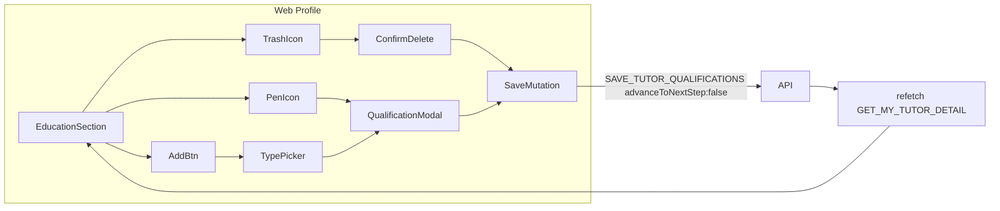

# Web Tutor Profile Education Edit/Add/Delete

## Current state

| Layer | Status |
|-------|--------|
| **Experience (web profile)** | Done — [`ExperienceModal`](libs/tutor-detail-ui/src/ExperienceModal.tsx), edit/delete/add in [`TutorDetailView`](libs/tutor-detail-ui/src/TutorDetailView.tsx), save in [`TutorProfilePage`](apps/web/src/app/components/tutor-profile/TutorProfilePage.tsx) |
| **Education (web profile)** | Read-only [`EducationSection`](libs/tutor-detail-ui/src/TutorDetailView.tsx) (~438–483) |
| **Onboarding** | Full editor in [`TutorQualification.tsx`](apps/web/src/app/components/tutor-onboarding/tutor-qualification/TutorQualification.tsx) — validation + `SAVE_TUTOR_QUALIFICATIONS` duplicated locally |
| **API** | Ready — replace-all by `qualificationType`; omit type = soft-delete; **Higher Secondary required** and **not deletable** |



## UX (mirror experience profile)

| Action | Behavior |
|--------|----------|
| **Edit** (pen icon) | Opens modal pre-filled for that qualification; `qualificationType` read-only |
| **Delete** (trash icon) | Confirm dialog → save list **without** that type (hidden for Higher Secondary) |
| **Add qualification** | Pick unused type (picker if multiple) → modal with empty fields |
| **Save** in modal | Validates, merges into full list by `qualificationType`, saves all qualifications |
| **Cancel** | Closes modal, no save |

**Row layout:** Title left; pen + trash on the right (same row as qualification title — match [`ExperienceSection`](libs/tutor-detail-ui/src/TutorDetailView.tsx)).

**Add availability:** Show "Add qualification" only when unused types exist (`EDUCATIONAL_QUALIFICATION_LIST` minus types already on file, excluding adding duplicate Higher Secondary — HS is always present post-onboarding).

**Delete confirm:** `"Delete this qualification? This cannot be undone."`

**Modal fields** (same as onboarding per card, no onboarding-only copy):
- `qualificationType` — read-only label on edit; select/picker on add
- `degreeName` — required except Higher Secondary (fixed/disabled)
- `fieldOfStudy` — required
- `boardOrUniversity` — required
- `gradeType` — select (CGPA / Percentage / Division)
- `gradeValue` — required
- `yearObtained` — required (1950–current year)

**Count badge** in section header updates after refetch (`formatEntryCount` on sorted list).

---

## Implementation

### 1. Shared qualification form helpers

Add [`libs/shared-utils/src/tutor-qualification-form.ts`](libs/shared-utils/src/tutor-qualification-form.ts) (export from [`index.ts`](libs/shared-utils/src/index.ts)):

- `QualificationFormRow` type (`qualificationType`, `boardOrUniversity`, `gradeType`, `gradeValue`, `yearObtained` as string, `fieldOfStudy`, `degreeName`)
- `mapQualificationToFormRow()` — from API/detail record
- `validateQualificationRow(row, now?)` — per-row rules from onboarding
- `validateQualificationList(rows)` — ensures Higher Secondary present when validating full list (for delete guard: block delete if it would remove last HS)
- `buildQualificationMutationInput(rows)` — trim fields, HS degreeName default, `displayOrder` by index
- `getAvailableQualificationTypes(existingTypes)` — types that can still be added

Add [`tutor-qualification-form.spec.ts`](libs/shared-utils/src/tutor-qualification-form.spec.ts) for validation and input builder.

### 2. Create `QualificationModal` (web DOM)

New file: [`libs/tutor-detail-ui/src/QualificationModal.tsx`](libs/tutor-detail-ui/src/QualificationModal.tsx)

Follow [`ExperienceModal.tsx`](libs/tutor-detail-ui/src/ExperienceModal.tsx) / [`BankDetailsModal.tsx`](libs/tutor-detail-ui/src/BankDetailsModal.tsx):

```typescript
type QualificationModalProps = {
  open: boolean;
  mode: 'edit' | 'add';
  initialRow: QualificationFormRow;
  saving?: boolean;
  error?: string | null;
  onClose: () => void;
  onSubmit: (row: QualificationFormRow) => void;
};
```

- Reuse field layout, labels, and placeholders from [`TutorQualification.tsx`](apps/web/src/app/components/tutor-onboarding/tutor-qualification/TutorQualification.tsx) (degree label varies by type)
- `validateQualificationRow` on Save
- Export from [`libs/tutor-detail-ui/src/index.ts`](libs/tutor-detail-ui/src/index.ts)

### 3. Update `EducationSection` + `TutorDetailView`

In [`TutorDetailView.tsx`](libs/tutor-detail-ui/src/TutorDetailView.tsx):

**Extend `TutorDetailViewProps`:**
```typescript
onSaveQualifications?: (rows: QualificationFormRow[]) => void | Promise<void>;
savingQualifications?: boolean;
qualificationSaveError?: string | null;
```

**Update `EducationSection`** (tutor mode when `onSaveQualifications` provided):
- Pen + trash icons per row (trash omitted for `HIGHER_SECONDARY`)
- "Add qualification" button below list / in empty state (when types available)
- Pass callbacks from parent

**Wire in `TutorDetailView`:**
- State: `qualificationModal`, `deletingQualificationType`, type-picker state for add
- Edit: find by `qualificationType` (or `id` → map to row), open modal
- Add: if one available type → open modal; if many → type picker then modal
- Save: merge row by `qualificationType`, call `onSaveQualifications(fullList)`
- Delete: confirm → filter out type → save (block if `HIGHER_SECONDARY`)
- Render `QualificationModal` (tutor mode only)

Reuse pen/trash SVG pattern from experience rows in the same file.

### 4. Wire save in `TutorProfilePage`

In [`TutorProfilePage.tsx`](apps/web/src/app/components/tutor-profile/TutorProfilePage.tsx):

- Import `SAVE_TUTOR_QUALIFICATIONS`
- Import `buildQualificationMutationInput` from `@tutorix/shared-utils`
- `useMutation` + `qualificationSaveError` state
- Handler:
  ```typescript
  await saveQualifications({
    variables: {
      input: {
        qualifications: buildQualificationMutationInput(rows),
        advanceToNextStep: false,
      },
    },
  });
  await refetch(); // GET_MY_TUTOR_DETAIL
  ```
- Pass props to `TutorDetailView`

### 5. Refactor web onboarding `TutorQualification`

Update [`TutorQualification.tsx`](apps/web/src/app/components/tutor-onboarding/tutor-qualification/TutorQualification.tsx) to use shared helpers (`mapQualificationToFormRow`, `validateQualificationRow`, `buildQualificationMutationInput`, `getAvailableQualificationTypes`) — keeps onboarding and profile validation identical.

---

## Critical constraints

- **`advanceToNextStep: false`** on all profile saves
- **Always send full qualification list** — API replace-all by type
- **Higher Secondary** must remain after any save; no delete affordance for it
- **One row per qualification type** — add only unused types
- **Admin view** unchanged (read-only, no callbacks)
- **Mobile** out of scope for this pass (follow-up can mirror [`ExperienceModal`](apps/mobile/src/app/components/tutor-profile/ExperienceModal.tsx) pattern)

---

## Files touched

| File | Change |
|------|--------|
| `libs/shared-utils/src/tutor-qualification-form.ts` | New — types, validation, input builder |
| `libs/shared-utils/src/tutor-qualification-form.spec.ts` | New — unit tests |
| `libs/shared-utils/src/index.ts` | Export new module |
| `libs/tutor-detail-ui/src/QualificationModal.tsx` | New — modal form |
| `libs/tutor-detail-ui/src/TutorDetailView.tsx` | Education edit/delete/add + modal wiring |
| `libs/tutor-detail-ui/src/index.ts` | Export modal + types |
| `apps/web/src/app/components/tutor-profile/TutorProfilePage.tsx` | Mutation + handler |
| `apps/web/src/app/components/tutor-onboarding/tutor-qualification/TutorQualification.tsx` | Use shared helpers |

No API or GraphQL schema changes required.

---

## Manual test plan

1. Profile with qualifications → each row shows pen; trash on all except Higher Secondary.
2. Edit a row → Save → list refreshes with updated data; count unchanged.
3. Add qualification → pick type → fill form → Save → new row appears; count increases.
4. Delete non-HS qualification → confirm → removed; count decreases.
5. Higher Secondary has no delete button.
6. Add button hidden when all types present.
7. Validation errors inline; invalid save blocked.
8. Certification stage unchanged after profile saves.
9. Admin tutor detail still read-only.
