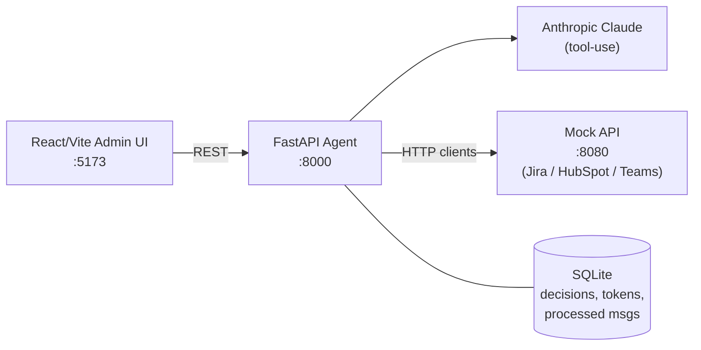
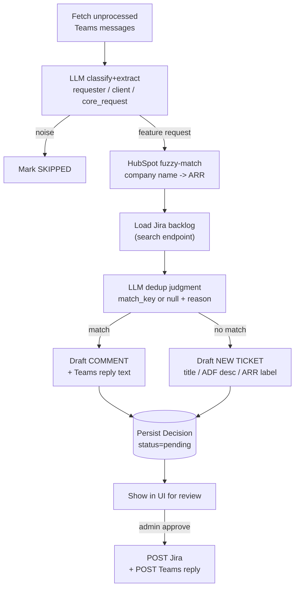
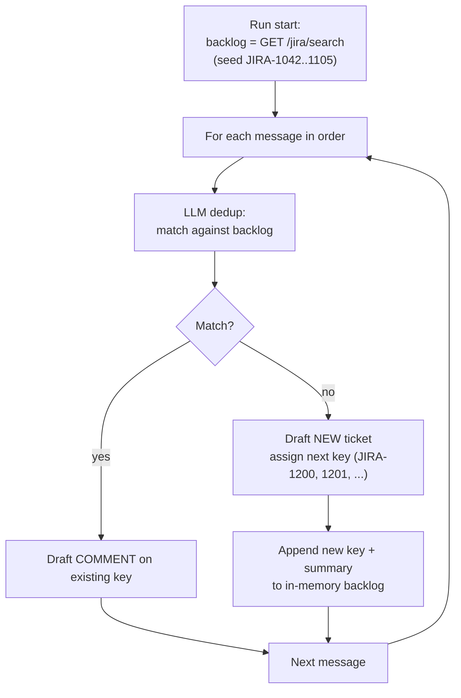

## Goals vs. grading rubric

- Completeness: covers all 4 functional steps (extract, enrich, dedup, feedback) + UI (process button, list, review, approve). Behavior matches the hand-verified [docs/dry-run-analysis.md](../../workflex/workflexx-case-study/docs/dry-run-analysis.md), which is the regression oracle.
- Technical quality: clean layering (clients / services / API / UI), structured LLM tool-use, Pydantic schemas at every boundary, no `Any`, automated tests. See **Anti-patterns we will NOT ship** below — each line of code is auditable against that table.
- Production-readiness: explicitly treated as a first-class concern — see the dedicated section below, not just a bullet.

## LLM choice (locked)

- **Default: `claude-sonnet-4-5`** — best accuracy/latency/cost balance for the two reasoning steps (extract, dedup) at this data volume (~70 messages, 7 backlog items). Justified in README.
- Overridable via `LLM_MODEL` env var. `LLMClient` is a thin interface so swapping to Haiku for extract-only or to another provider is a single-file change.
- All calls use Anthropic **Tool Use** with strict JSON schemas; no regex/JSON-repair fallback paths in the hot path.

## Architecture

## Pipeline (per message)

## Repo layout (all new code lives next to the untouched `mock-api/`)

- `agent/app/main.py` — FastAPI app, CORS, router wiring, startup token bootstrap
- `agent/app/config.py` — `pydantic-settings` (`ANTHROPIC_API_KEY`, `MOCK_API_BASE_URL`, `LLM_MODEL`, etc.)
- `agent/app/clients/jira.py|hubspot.py|teams.py` — typed httpx clients with retry + timeouts; Teams handles OAuth2 token exchange + refresh
- `agent/app/clients/llm.py` — Anthropic wrapper, exposes `extract()`, `dedup()`, `draft_reply()` using Claude Tool Use with strict JSON schemas so outputs are parsed deterministically
- `agent/app/services/pipeline.py` — orchestrates extract → enrich → dedup → draft, emits `Decision` rows
- `agent/app/services/enricher.py` — company name normalization + HubSpot search (normalized exact match first, CONTAINS_TOKEN fallback, LLM tiebreak only if >1 candidate)
- `agent/app/services/matcher.py` — owns the **runtime-growing backlog** for a run: starts with `GET /jira/rest/api/3/search?jql=project=JIRA`, then appends each new CREATE decision drafted earlier in the same run. Feeds compact `{key, title, one-line summary}` rows to the LLM and returns `{match_key, reason, confidence}`. See the **Runtime-growing backlog** section below.
- `agent/app/services/drafter.py` — builds Jira create payload (ADF via helper), comment payload, and Teams reply message
- `agent/app/services/submitter.py` — approval handler: calls Jira + Teams, stores result, idempotent via decision id
- `agent/app/api/` — routers: `POST /process`, `GET /decisions`, `PATCH /decisions/{id}` (edit drafted text), `POST /decisions/{id}/approve`, `POST /decisions/{id}/reject`, `GET /health`
- `agent/app/storage.py` — SQLite via `sqlite3` (or SQLModel) with three tables: `decisions`, `processed_messages`, `service_tokens`
- `agent/tests/` — pytest: extractor/matcher/enricher unit tests with fake LLM + `httpx.MockTransport` fed by real captured mock-api responses; **one end-to-end test that replays the full 70-message seed and asserts every row of the dry-run oracle (`docs/dry-run-analysis.md`)** — including the 20 runtime-backlog matches that prove ticket K can dedup against ticket Q created earlier in the same run
- `ui/` — Vite + React + TypeScript single-page app
  - `App.tsx`: header, "Process Messages" button (with progress), tabs for `Pending | Submitted | Skipped`
  - `DecisionCard.tsx`: shows original Teams text, extracted fields, ARR pill, decision badge (CREATE / UPDATE JIRA-XXXX / SKIP), editable draft (title+body or comment body), dedup reasoning, `Approve & Submit` / `Edit` / `Reject`
  - `api.ts`: typed fetch wrapper to the agent
- `docker-compose.yml` — three services: `mock-api` (reuses provided Dockerfile), `agent` (new Dockerfile, `depends_on: mock-api`), `ui` (nginx-served Vite build)
- `.env.example`, `README.md`, `Makefile` (bootstrap, test, up)

## Key design decisions (call-outs for reviewers)

- **Runtime-growing backlog (correctness invariant)**: see dedicated section below. Messages are processed sequentially; each newly drafted CREATE is added to the matchable set so subsequent messages can dedup against it within the same run. This is the headline correctness property of the dedup logic.
- **Human-in-loop by default**: nothing is written to Jira or Teams until the admin clicks Approve. Matches the brief ("review drafted ticket content before it submits").
- **Claude Tool Use, not freeform JSON**: each LLM step uses a registered tool with a strict JSON schema — eliminates "fix the JSON" hacks and gives deterministic parsing.
- **Two-pass LLM**: separate extract and dedup calls. Smaller, cacheable prompts; extract can use a cheap model and dedup can use Sonnet. Both behind a pluggable `LLMClient` so swapping providers is a one-file change.
- **Fuzzy company matching is deterministic first**: normalize → HubSpot `query` + `CONTAINS_TOKEN` filter; only ask the LLM to disambiguate when HubSpot returns zero or multiple hits. Keeps token spend low and results explainable.
- **Token bootstrap**: on first startup the agent hits the mock's `POST /auth/tokens/{jira|hubspot|teams}` and caches the results in SQLite, so `docker compose up` works with just an `ANTHROPIC_API_KEY`.
- **Idempotent pipeline**: `processed_messages` table keyed by Teams `msg.id` so re-clicking "Process" doesn't duplicate work; existing pending decisions are refreshed not re-created.
- **Observability**: structured JSON logs (stdlib logging + `RichHandler` in dev), correlation id per pipeline run, `/health` checks LLM + mock-api reachability.
- **Resilience**: httpx clients with timeout + `tenacity`-style retry on 5xx/429; Teams token auto-refresh on 401.

## Runtime-growing backlog (correctness invariant)

The dedup matchable set is **not** the static seed snapshot. It grows as the run progresses.

Concrete behavior (verified end-to-end against the [dry-run oracle](../../workflex/workflexx-case-study/docs/dry-run-analysis.md)):

- msg-004 (Globex, CSV export) → CREATE `JIRA-1200`. Backlog now includes 1200.
- msg-016 (OsCorp, CSV export, 12 messages later) → UPDATE `JIRA-1200` because the matcher saw 1200 in the in-run backlog.
- msg-027 (LexCorp, 2FA) → CREATE `JIRA-1209`. msg-028 (Stark, 2FA, the very next message) → UPDATE `JIRA-1209`.
- 20 of 45 UPDATE decisions in the oracle hit a runtime-created ticket — the integration test asserts each one.

Implementation:

- `matcher.py` exposes `Backlog` as an in-memory list seeded from the Jira search at run start. It is **not** a snapshot of the real Jira state during the run (the real Jira is only mutated on admin approval, much later).
- After `pipeline.draft()` produces a CREATE decision, the pipeline calls `backlog.append(BacklogItem(provisional_key="JIRA-PROV-{n}", title=..., summary=...))`. Provisional keys avoid pretending we know the next real Jira key — the actual key is assigned by `mock-api` only at approve time.
- The LLM dedup prompt explicitly distinguishes seed entries from provisional entries so the reasoning logs reflect why a match against a same-run draft happened.
- Concurrency: messages within a run are processed **sequentially** (not in parallel) precisely so the runtime backlog stays consistent. The `asyncio.Semaphore(4)` mentioned in Performance applies to *across-run* parallelism for LLM calls of independent kinds, not intra-run message processing. This is a deliberate trade-off: correctness over throughput, called out in the README.
- On admin approval of a CREATE decision, the provisional key is replaced with the real `JIRA-XXXX` returned by the mock-api, and the Decision row is updated. Subsequent comment-decisions that referenced the provisional key are rewritten to the real key (single SQL update keyed on `provisional_key`).

## Concrete API surface (agent → UI)

- `POST /api/process` → **returns `202 Accepted` with `{run_id}` immediately**; pipeline runs in a background task. Blocking for ~70 messages × 2 LLM calls is not acceptable in production.
- `GET /api/runs/{run_id}` → polled by the UI: `{status: queued|running|complete|failed, processed, total, created, updated, skipped, errors}`.
- `GET /api/decisions?status=pending|submitted|skipped|error&run_id=...` → list of `Decision` (paginated).
- `PATCH /api/decisions/{id}` → edit drafted `title`/`body`; rejected if decision is not in `pending` state (optimistic concurrency via `version` column).
- `POST /api/decisions/{id}/approve` → submits; returns `{jira_key, teams_reply_id}`. Safe to retry (idempotent on `decision.id`).
- `POST /api/decisions/{id}/reject` → marks rejected (no external calls).
- All error responses use `**application/problem+json**` (RFC 7807) with a stable `type` URI per error class.

## Production-readiness commitments

Concrete, verifiable items I will implement (not aspirational):

### Configuration & secrets

- All config via `pydantic-settings` with a typed `Settings` object; validated on startup — app refuses to boot on missing/invalid values.
- Secrets (`ANTHROPIC_API_KEY`, service tokens) loaded from env only; never logged. `.env.example` documents every var; `.env` is gitignored.
- Separate `dev` / `prod` log config (pretty in dev, JSON in prod) driven by `APP_ENV`.

### Reliability

- `httpx.AsyncClient` with explicit `connect`/`read`/`write`/`pool` timeouts and bounded connection limits for every external call.
- `tenacity` retry on 5xx and 429 with exponential backoff + jitter; `Retry-After` honored; non-retryable errors (4xx) surface immediately.
- Teams OAuth access token cached with expiry tracking and proactive refresh before expiry; transparent retry once on 401.
- Anthropic client wrapped with retry on 529/overloaded + timeouts; distinguishes `LLMRetryableError` vs `LLMFatalError`.
- Pipeline runs as a background job with a per-message try/except so one bad message cannot fail the whole batch; failures are captured as a `Decision` with `status=error` + diagnostic.

### Data integrity

- SQLite with WAL mode; schema migrated via a simple versioned `migrations/` runner on startup.
- Idempotency keys on the submit path (`Idempotency-Key = decision.id`) so an approve-retry never creates two Jira tickets or two Teams replies. The submitter is transactional against the local DB: external call result is persisted before the endpoint returns.
- All external identifiers (Teams msg id, Jira key, Teams reply id) stored on the `Decision` for full audit.

### Security

- CORS locked to the configured UI origin (not `*`) in prod mode.
- Pydantic input models on every route; FastAPI automatic 422 for bad payloads.
- Output sanitization: Teams message text and LLM-drafted text are escaped when rendered in the UI (React default + explicit no `dangerouslySetInnerHTML`).
- **Log redaction filter**: `Authorization`, `client_secret`, `api_key`, and `access_token` fields are redacted before any log record is emitted (centralized `logging.Filter`).
- Containers run as non-root users; `.dockerignore` excludes `.env`, tests, `__pycache_`_; pinned base images (`python:3.12-slim`, `node:20-alpine`, `nginx:alpine`).
- Dependencies pinned (`requirements.txt` with hashes via `uv`/`pip-tools`; `package-lock.json` committed).
- **Supply chain**: `pip-audit` (Python) and `npm audit --audit-level=high` (JS) run in CI; failures block merge.
- No secrets baked into images; all injected at runtime. Docker-compose sets `read_only: true` on the agent filesystem except `/app/data` volume.
- Compose sets **resource limits** (`mem_limit`, `cpus`) on each service to keep the demo honest about production posture.

### Observability

- Structured JSON logging (stdlib `logging` with a JSON formatter) with: `run_id`, `decision_id`, `msg_id`, `service`, `latency_ms`, `status`.
- Per-request correlation id middleware; propagated to all downstream client calls.
- Token usage metrics per LLM call (input/output tokens, model, latency) stored with each decision so reviewers can see cost per message.
- `/health` = liveness (always 200 if process is up). `/ready` = readiness (checks mock-api + Anthropic reachability; returns per-dependency status).
- `/metrics` Prometheus-style endpoint with counters: `decisions_total{type=create|update|skip|error}`, `llm_calls_total`, `external_call_duration_seconds` histogram.

### Performance & cost

- Initial Jira backlog fetched **once** at run start (not per-message re-fetch); the in-memory backlog is then **appended to** as new CREATE decisions are drafted (see **Runtime-growing backlog** above).
- Messages within a run are processed **sequentially** to keep the runtime backlog consistent — correctness over throughput. `asyncio.Semaphore(4)` is reserved for parallelism opportunities that don't violate ordering (e.g., per-run prefetch of the HubSpot company list).
- **Anthropic prompt caching** (`cache_control: ephemeral`) on the static system prompt and the backlog snapshot — cuts dedup cost dramatically when processing many messages in one run.
- Per-run **token budget** (`MAX_TOKENS_PER_RUN`, default 500k) — pipeline halts gracefully and reports remaining work if exceeded, rather than silently burning budget.
- Model, input/output token counts, and estimated cost are stored on every `Decision` for auditability.
- LLM prompts trimmed: backlog summaries (title + 1-line description) not full tickets; user content capped and logged.

### Async jobs & graceful shutdown

- `/api/process` enqueues a background task (FastAPI `BackgroundTasks` or `asyncio.create_task` tracked in a run registry). Returns `202` with `run_id` instantly.
- `GET /api/runs/{id}` streams progress so the UI can render a live progress bar.
- On SIGTERM/SIGINT the app drains in-flight runs (configurable grace period), closes httpx clients, and flushes logs. Compose uses `stop_grace_period`.
- Rate limit on `/api/process` (e.g., 1 run in-flight per instance) to prevent accidental double-clicks launching parallel runs.

### Error taxonomy

- Single hierarchy in `errors.py`: `AppError` → `ValidationError`, `AuthError`, `ExternalAPIError` (→ `JiraError`, `HubspotError`, `TeamsError`), `LLMError` (→ `LLMRetryableError`, `LLMSchemaError`, `LLMBudgetError`).
- Global FastAPI exception handlers map each to a **stable HTTP status + `problem+json` body** with a `type` URI, `title`, `detail`, and `trace_id`. No raw stack traces leak to the client.
- In the pipeline, per-message exceptions are caught and recorded as `Decision(status=error, error_type, error_detail)` — one bad message never kills the batch.

### Quality gates

- `ruff` + `mypy --strict` on the backend; `eslint` + `tsc --noEmit` on the frontend; all wired into `make lint` and a GitHub Actions workflow.
- `pytest` suite runs in CI with coverage threshold (target ≥ 80% on `services/`).
- Pre-commit hooks: `ruff`, `ruff-format`, `eslint --fix`, trailing-whitespace, `detect-secrets`.

### Testing strategy

- **Unit**: extractor, matcher, enricher, drafter with fake `LLMClient` and `httpx.MockTransport` fed by *real captured* mock-api responses (fixtures checked in). Covers happy paths + edge cases (ambiguous company, LLM schema violation, HubSpot miss, Teams 401 refresh, Jira 409, noise messages).
- **Contract**: small suite that hits the live mock-api (skipped if not reachable) to assert our client payloads still parse — guards against mock drift.
- **Integration (the dry-run oracle)**: one end-to-end `pytest` that replays **all 70 seed messages** against the live mock-api with the `LLMClient` stubbed to deterministic outputs derived from [docs/dry-run-analysis.md](../../workflex/workflexx-case-study/docs/dry-run-analysis.md). The full expected decisions table is loaded as parametrized cases:
  - **15 CREATE** assertions (msg-004, 005, 006, 008, 010, 019, 021, 023, 025, 027, 040, 041, 042, 045, 046)
  - **45 UPDATE** assertions split into two groups:
    - **25** matching seed tickets (e.g., msg-001 → JIRA-1042)
    - **20 matching runtime-created tickets** (e.g., msg-016 → ticket from msg-004; msg-028 → ticket from msg-027; msg-031/032 → ticket from msg-006). These are the assertions that prove the runtime-growing backlog works.
  - **10 SKIP** assertions (msg-061..070)
  - Each row also asserts the resolved client + ARR (e.g., msg-001 → "Hooli Inc." + $520k) so company fuzzy-matching is part of the regression.
  - Test resolves "ticket from msg-N" placeholders by reading the decision row created earlier in the run — exactly mirroring the production matcher.
- **UI**: Vitest + React Testing Library for `DecisionCard` state (edit/approve/reject), loading/error states, and the Process button's progress lifecycle.
- **Smoke**: `make smoke` brings the stack up with `docker compose`, waits for `/ready`, POSTs `/api/process`, polls `/api/runs/{id}` until complete, and asserts the {15 create, 45 update, 10 skip} totals.

### Developer experience

- `Makefile` targets: `bootstrap`, `dev` (hot-reload), `test`, `lint`, `typecheck`, `up`, `down`, `logs`, `smoke`.
- `README.md` with: problem framing, architecture diagram, 1-command quickstart, env var reference, troubleshooting, trade-offs, and "what I'd do next with another day".
- `docs/` with `ARCHITECTURE.md` (sequence diagrams), `DECISIONS.md` (ADR-lite log of major choices), `PROMPTS.md` (all LLM prompts checked in for reviewability).

## Anti-patterns we will NOT ship (explicit guardrails)

These are concrete failure modes. Each is paired with the rule we follow instead. I will treat these as build-time invariants and call them out in code review of my own output.

| Anti-pattern                                                                                        | Why it's bad                                                                     | What we do instead                                                                                                                                                                                                                                                               |
| --------------------------------------------------------------------------------------------------- | -------------------------------------------------------------------------------- | -------------------------------------------------------------------------------------------------------------------------------------------------------------------------------------------------------------------------------------------------------------------------------- |
| `httpx.AsyncClient()` constructed inside every call                                                 | Destroys connection pooling, leaks sockets, exhausts file descriptors under load | **One** `httpx.AsyncClient` per external service, owned by FastAPI **lifespan**, injected via `Depends()`. Closed on shutdown.                                                                                                                                                   |
| `CORSMiddleware(allow_origins=["*"], allow_credentials=True)`                                       | Browsers reject this combination silently; classic copy-paste hazard             | Explicit origin list from `Settings.cors_origins` (e.g. `http://localhost:5173`). With `allow_credentials=True`, never `*`.                                                                                                                                                      |
| Hallucinated retry math like `wait = 50 * (attempt + 1)`                                            | Blocks the request loop for ~100s; bricks a web cycle                            | `tenacity` with `wait_exponential(multiplier=0.5, min=0.5, max=8)` + jitter, capped `stop_after_attempt(3)`, **honors `Retry-After`**. Total bounded wait < 15s. Documented in code.                                                                                             |
| Custom regex "JSON repair" of LLM output                                                            | Brittle; obscures real schema failures; encourages silent corruption             | **Anthropic Tool Use** with a registered tool whose `input_schema` is the Pydantic model's `model_json_schema()`. Output is parsed via `Model.model_validate(tool_use.input)`. On schema failure: one structured retry, then surface `LLMSchemaError`.                           |
| Parsing API payloads as `dict` / `Any`                                                              | No type safety, no validation, no IDE help, runtime KeyErrors                    | **Every** request body, response model, and external-API payload modeled as a Pydantic class in `agent/app/schemas/`. Routes declare `response_model=...`. External-API responses are parsed into Pydantic models inside the client (not in services). `mypy --strict` enforces. |
| Manual curl scripts in lieu of tests                                                                | Not repeatable, not in CI, easy to lie about coverage                            | `pytest` + `vitest` suites in CI with a coverage floor on `services/`. The `dry-run-analysis.md` table is encoded as parametrized regression assertions. No "manual test" file accepted.                                                                                         |
| Ignoring AI-generated code smells (long params, dead branches, unused vars, copy-pasted try/except) | Reviewers immediately spot un-curated AI output                                  | Every file passes `ruff` + `mypy --strict` + `eslint` before commit. I will read each generated file and refactor — no `# noqa` to silence warnings, no `Any` to dodge typing. Commits are reviewable diffs, not 2000-line dumps.                                                |
| Logging request bodies / Authorization headers                                                      | Token leakage in logs — compliance + security incident waiting to happen         | Centralized `logging.Filter` redacts `Authorization`, `client_secret`, `api_key`, `access_token`, and `password` from all `LogRecord` fields and exception args. Verified by a unit test that asserts a known token does not appear in captured logs.                            |
| Blocking the request thread for long LLM/IO work                                                    | Web workers stall, healthchecks fail, UX freezes                                 | `/api/process` is `async`, returns `202 + run_id` immediately, work runs as a tracked background task. UI polls `/api/runs/{id}`.                                                                                                                                                |
| Hardcoded URLs / model names / timeouts                                                             | Untestable, undeployable                                                         | All such values live in `Settings` (env-driven, validated). No magic numbers in business code.                                                                                                                                                                                   |
| Generic `except Exception: pass` swallowing errors                                                  | Hides real failures; "it works" until it silently doesn't                        | Per-message try/except in the pipeline catches and **records** the error to the `Decision` row with type+message; no silent swallow anywhere else. `ruff` rule `BLE001` enabled.                                                                                                 |

## What I am explicitly NOT doing (and why — honest trade-offs for the README)

- **No Postgres / no Redis**: SQLite (WAL) is sufficient for a single-instance admin tool. The storage layer is behind a narrow interface so swapping is mechanical. Calling this out rather than pretending.
- **No real auth on the agent UI**: the brief says "internal admin" — I add a simple header-based API key check (configurable off for the demo) and document that a real deployment would sit behind SSO/mTLS. I won't ship a half-baked login form.
- **No embedding-based semantic dedup**: 7 backlog items don't justify a vector store. Architecture leaves a `DedupStrategy` seam so `EmbeddingDedup` is a drop-in.
- **No queue/worker (Celery/Arq)**: in-process background tasks are adequate at this scale; interface is small enough that swapping to an external queue is a contained change. Documented.

## Delivery checklist

1. Single command run: `cp .env.example .env && docker compose up --build`.
2. Open `http://localhost:5173` → click Process Messages → watch live progress → review decisions → approve.
3. README covers: architecture, how to run, how to swap LLM provider, trade-offs (including the section above), and "what I'd do next with another day".
4. Git: initialize local repo with coherent, reviewable commits grouped by concern (scaffold, config, clients, services, API, UI, compose, tests, docs). User will create the private GitHub remote and add `coding-challenge@getworkflex.com`.

