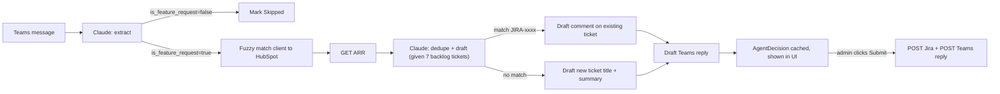

## Repo layout

```
workflexx-case-study/
  mock-api/                  # copied verbatim from starter kit
  docker-compose.yml         # extended to run bridge-agent + frontend
  README.md                  # how to run end-to-end
  .env.example
  .gitignore
  backend/
    pyproject.toml / requirements.txt
    bridge_agent/
      config.py              # env loading (ANTHROPIC_API_KEY, MOCK_BASE_URL, tokens...)
      clients/
        teams.py             # OAuth token cache, list messages, post reply
        jira.py              # Basic auth, search JQL, get/create issue, add comment, ADF helpers
        hubspot.py           # search companies by name, return ARR
      llm/
        claude.py            # Anthropic SDK wrapper with JSON-schema tool use
        prompts.py           # extraction + dedupe+draft prompts
      models.py              # Pydantic: TeamsMessage, Extraction, AgentDecision, etc.
      matching.py            # deterministic fuzzy client-name matcher (rapidfuzz)
      agent.py               # end-to-end pipeline per message + orchestrator
      api.py                 # FastAPI app: /api/process, /api/decisions/{id}, /api/decisions/{id}/submit
      store.py               # in-memory run/decision store (sufficient for demo)
    tests/
      test_matching.py
      test_agent_pipeline.py # uses recorded Claude fixtures, no network
  frontend/
    vite.config.ts, tsconfig.json, package.json
    src/
      App.tsx, main.tsx, api.ts, types.ts
      components/DecisionCard.tsx, ProgressBar.tsx, Editable.tsx
      styles.css
```

## Agent pipeline (per message)



Two Claude calls per feature-request message:

1. **Extract** — returns `{is_feature_request, client_name_raw, requester_hint, core_request, one_line_summary}` via `tools`/JSON schema for strict typing.
2. **Dedupe + Draft** — inputs: core_request, backlog (id/title/description), client+ARR. Returns `{decision: "comment"|"create", matched_ticket_id?, ticket_title?, ticket_summary?, comment_body?, teams_reply, confidence, reasoning}`.

Client name matching: do it deterministically in code with `rapidfuzz` against HubSpot names (token-set ratio, threshold ~85). Falls through to "client not found in CRM" — surfaced in the UI; ARR omitted from ticket/reply.

Concurrency: `asyncio.gather` with a semaphore (e.g. 5) over `httpx.AsyncClient` and the Anthropic async SDK.

## Backend API

- `POST /api/process` — fetches all Teams messages (paginating `$skiptoken`), runs the pipeline in parallel, stores decisions by `run_id`, returns `{run_id, decisions: AgentDecision[]}`.
- `GET  /api/runs/{run_id}` — fetch decisions for reload.
- `PATCH /api/decisions/{id}` — edit drafted title/summary/comment/teams_reply before submit.
- `POST /api/decisions/{id}/submit` — calls Jira + Teams; returns `{jira_key, teams_reply_id}`; idempotent by marking decision as submitted.
- `GET  /api/health` — sanity check that all three mock services + the Anthropic key are reachable.

Nice-to-have: SSE endpoint `GET /api/runs/{run_id}/events` streaming per-message progress (`extracting`, `enriching`, `drafting`, `done`).

## Frontend

Single page. Top bar: health chips for Teams / Jira / HubSpot / Claude + a "Process Messages" button. Below: list of `DecisionCard`s, each with:

- Original Teams message (sender, text)
- Extracted block: requester, client, matched HubSpot company + ARR
- Decision badge: `Update JIRA-1042`, `Create new ticket`, or `Skipped (not a feature request)`
- Editable draft (title+summary OR comment body) + editable Teams reply
- `Submit` button → on success shows the returned Jira key and collapses the card

Styling: minimal CSS (no heavy UI kit); keep it clean and readable. Tailwind is easy to add if preferred.

## Configuration

`.env.example`:

```
MOCK_BASE_URL=http://localhost:8080
JIRA_EMAIL=candidate@workflex.com
JIRA_API_TOKEN=
HUBSPOT_API_TOKEN=
TEAMS_CLIENT_SECRET=
ANTHROPIC_API_KEY=
ANTHROPIC_MODEL=claude-sonnet-4-5
```

README flow: `docker compose up mock-api` → open `/dashboard` → generate 3 tokens → paste into `.env` → `cd backend && uvicorn bridge_agent.api:app --reload` → `cd frontend && npm i && npm run dev` → open the UI → click "Process Messages".

## What we explicitly will NOT do
- No persistent DB — in-memory run store is fine for the demo.
- No auth on the admin UI (local dev only).
- No real Microsoft Graph; we call the mock's `/graph/v1.0/...` paths.

## Key risks & mitigations
- **Claude JSON drift** → use SDK `tools` with a strict JSON schema so outputs are parseable; validate via Pydantic; retry once on validation failure.
- **Client name mismatches** ("Hooli" vs "Hooli Inc.") → rapidfuzz token-set ratio on HubSpot names; show "unmatched" explicitly in the UI rather than guessing wildly.
- **Backlog dedup false positives** (e.g. msg-058 SSO → JIRA-1042) → let Claude return a confidence + reasoning and surface both in the card so the admin can flip Create↔Comment manually.
- **Off-topic messages** (wifi, birthday, coffee machine) → extraction step returns `is_feature_request=false`; UI shows them as Skipped for transparency but doesn't hit Jira.
